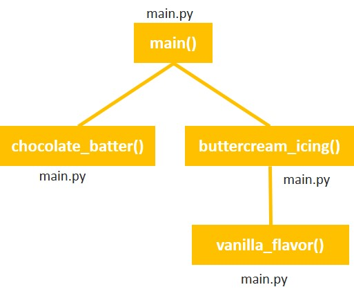

# 5-5. Hierarchy Chart

As the program gets bigger it can get difficult to track all the functions and the relationships between them. So we use a hierarchy chart  

A hierarchy chart, shows boxes that represent each function in a program. The boxes are connected in a way that illustrates the functions called by each function  

The hierarchy chart for our program chcolate cake with buttercream icing will look like this:
  

The file name where the function is defined is depicted outside the box

  

    👉 5-5 Try this
  

  Draw a hierarchy chart for vanilla cake with creamcheese icing

  

    👀 Answer
  

  <a href="hc55.draw">Vanilla Cake with Creamcheese icing</a>

