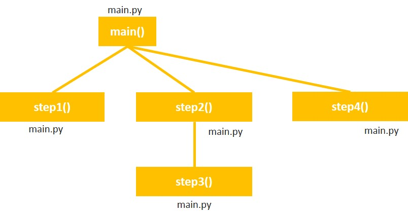

# 5-6. Writing Skeletal Code - pass keyword

When we are initially writing a program’s code, we know the names of the functions but may not know all the details of the code that will be in those functions  
Then we use the **pass** keyword to create empty functions  

**For example**  
Given the hierarchy chart as follows, let us write the empty functions or skeletal code  



```python
def step1():
  pass

def step2():
  step3()

def step3():
  pass
  
def main():
  step1()
  step2()
  step4()

main()
```

<details>
  <summary>
    💡 Note:
  </summary>
  pass can be used not just in empty functions, it can be used as placeholder in if statement or for or any blocks
</details>