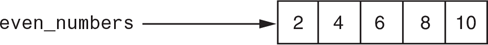

# 7-2, 7-3. Creating a List

## 7-2. Creating an empty list
Syntax: <list_name> = []
```python
scores = []

# or

scores = list()
```

## 7-3. Creating list with elements/values
Syntax: <list_name> = [\<element1\>, \<element2\>,\<element3\> ]
- List elements are enclosed in brackets and separated by commas
- Elements can be of any datatype

### a. Integer list
All elements are ints

```python
# Example of an integer list
even_numbers = [2, 4, 6, 8, 10]
suchi_print(even_number)  # We can print elements of a list using print
```

<details>
  <summary>
    💡 Note:
  </summary>
  I have written a function called suchi_print which prints any sequence in a pretty format.<br>
  We will be using that instead of print<br>
  To use my function we need to import it
  <code>from suchi_pretty_print import suchi_print</code>
</details>

After the list is created even_numbers refers to the data elements like so:



### b. float list
All elements are floats
```python
# Example of a float list
sales = [4.5, 5.6, 6.3, 7.8, 5.7]
suchi_print(sales)
```

### c. string list
All elements are strings
```python
# Example of a string list
favorite_actors = ["George Clooney", "Tom Hanks", "Henry Cavill"]
suchi_print(favorite_actors)
```

### d. bool list (all elements are booleans)
```python
# Example of a bool list
bool_list = [True, False, False, True, True]
suchi_print(bool_list)
```

### e. Multiple Datatypes:
Lists can have elements of any datatype including a list

```python
# Multiple Datatypes in a list
student = [123678, "James Smith", "COSC", 3.67, [90, 95, 67]]
suchi_print(student)
```


## Lists are ordered

The order in which elements appear in a list is important

```python
favorite_actors1 = ["George Clooney", "Tom Hanks", "Henry Cavill"]

favorite_actors2 = ["Tom Hanks", "George Clooney", "Henry Cavill"]

if favorite_actors1 == favorite_actors2:
  print("Lists are the same")
else:
  print("Lists are not the same")
```

## Duplicity

Lists can have the same value appear multiple times

```python
l1 = [1, 2, 3, 2, 3]

```
Values 2 and 3 are repeating

<details>
  <summary>
    🚩 To remember:
  </summary>
  Sets cannot have duplicate values 
</details>