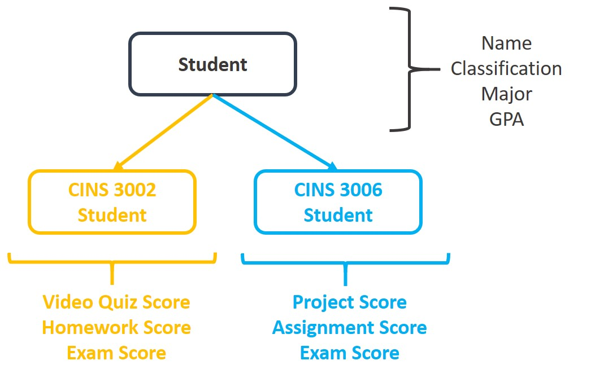
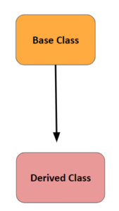

# Intro to Inheritance
- Inheritance allows a new class to extend an existing class. the new class inherits the members of the class it extends
- This is like a parent and child relationship.
- The child class (also called subclass or derived class) inherits all the properties of the parent class (superclass or base class) and can also have its own properties


## Why inheritance?
- When one object is a specialized version of another object, there is an "is a " relationship betweeen them.
- Through inheritance we can "clone" an existing class and all its attributes and methods and then add our own attrbiutes and methods

## For example:


- A college student has attributes name, major, classification and GPA
- If this student were to take the class CINS 3002, then in addition to name, major, classification, gpa he/she will have attributes to store the scores specific to this class, i.e.
  - video quiz
  - homework
  - exam
- So it makes no sense to create a class for CINS3002 student and repeat the attributes that are already stored by Student class
- Instead, a sub class or child of Student can be created which
  - "inherits" name, major, classification and gpa AND
  - can also define its own attributes (or methods)
- Similarly with CINS 3006, which has its own set of attributes

<details>
  <summary>
    🚩 To remember
  </summary>
  Through inheritance we can "clone" an existing class and all its attributes and methods and then add our own attrbiutes and methods<br>
The class we clone is called the parent (or super class) and the new class created is called a child (or sub class)
</details>


## Different types of inheritance
1. Single Inheritance - (parent-child)



2. Mutliple Inheritance - (parent-parent-child)


3. Multi-Level Inheritance - (parent-child-grandchild)

   

### Without inheritance

Let's look at two classes
  
```python
class Student():
  def __init__(self):
    print("This is Student init")

class CINS_Student(): 
  pass
```
- Let us create an object of Student
- init gets called and the print statement is executed
  
```python
student1 = Student()
```

Now let us create an object of CINS_Student

```python
cins = CINS_Student()
```

This class doesn't have an init method, so nothing is displayed