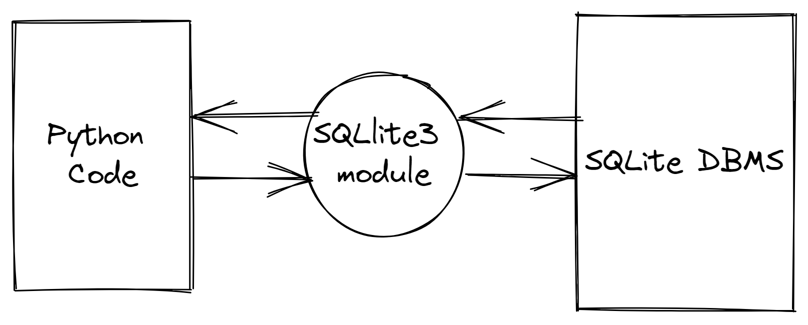

# 14-4. SQLlite 3 Module in Python

Python application cannot directly "talk to" the SQLite DBMS    

So we import a module called sqlite3 that acts like a translator  

It relays MySQL statements stored in Python strings to the DBMS and relays the responses back to Python application

SQLite3 creates a connection to the database and it will obtain a cursor  

  

    🤓
  

  Think of this cursor as the file pointer we have seen in the files chapter

